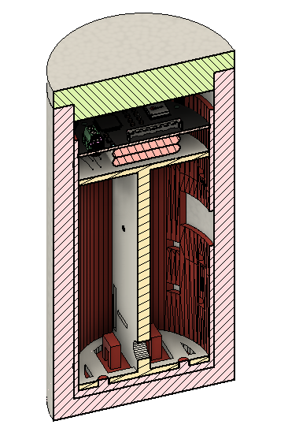

# TRXCAN
This project aims to develop an open platform that allows CANSAT developers to easily add RF communications and APRS tracking. It will also add GPIO and flight computer control a weather balloon.

This project is intended to fit inside an standardized CANSAT, measuring 66mm in diameter and 3CM in height. 

This project is currently in development. 

Currently the intended platform can be viewed in the following images:

